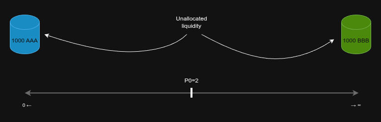
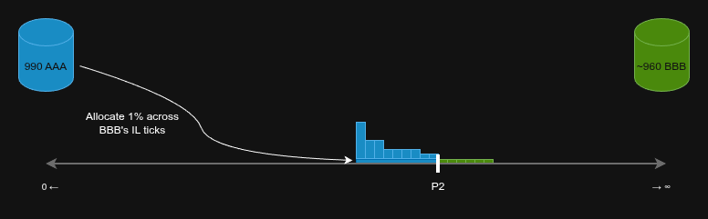
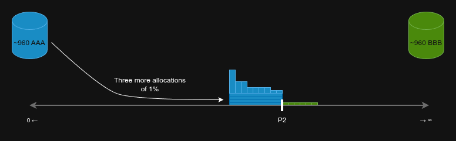

# Drifty By Example | Ep. 2 — The Liquidity Pool Lifecycle

In Drifty, a liquidity pool is similar to those in other Decentralized Exchanges (DEXs). It's an isolated market where traders can exchange one asset for another within a specific trading pair.

Liquidity Providers (LPs) deposit assets into the pool, and traders use this liquidity to swap their own assets. In return for this service, traders pay a small fee with each trade. These fees are distributed to LPs proportional to their share of the total liquidity — the more you contribute, the more you earn.

LPs interact with pools via their personal Gateways, while traders interact with pools directly.

![Fig. 1 - Basic Pool Interaction Diagram. [Liquidity Provider] -> [LP Gateway] -> [Liquidity Pool] <- [Trader]](./imgs/ep2/1.png)

A Liquidity Pool smart contract governs all interactions, ensuring the process is smooth and secure for everyone. This article will focus on this smart contract.

## The Pool Lifecycle

A Drifty Liquidity Pool operates in one of three states:

1.  **Creation**: The initial setup phase where the pool is configured by its creator.
2.  **IL Accumulation**: A period, often during price discovery, where the pool's AMMs accumulate Impermanent Loss. This phase begins when one of the AMMs has fully recovered from previous IL.
3.  **IL Recovery**: A period where the AMMs work to recover from Impermanent Loss. This phase starts if the previously recovered AMM begins to accumulate IL again.

![Fig. 2 - Liquidity Pool Lifecycle. [Start] -> [Creation] -> [IL Accumulation] <-> [IL Recovery]](./imgs/ep2/2.png)

### Pool Creation

Before trading can begin, a pool must be created for the trading pair. The system is permissionless, so anyone can create a pool. Creating a pool is straightforward: you deploy the smart contract, provide the token contract addresses, and set the initial price.

In a trading pair, one token is the _base_ and the other is the _quote_. This distinction isn't about importance; it's a convention for defining the price. In Drifty, the price is expressed as "quote per base," answering the question: "How many units of the quote asset do I get for one unit of the base asset?" Trading pairs (and pools) in Drifty are always named in the following format: `(base ticker)/(quote ticker)`.

For example, consider a new **AAA/BBB** pool with an initial price `P0 = 2`. This means 1 **AAA** can be traded for 2 **BBB**, and 1 **BBB** for 0.5 **AAA**.

A newly created pool is visualized as follows:

The price plane is composed of liquidity ticks. Drifty uses a simplified version of the ticks found in Uniswap V3, where the price at any given tick `i` is `1.0001^i`. Unlike AMMs using a `y=kx` formula, Drifty maintains a constant price across each tick, similar to a traditional order book.

Unlike many other DEXs, Drifty features single-sided liquidity provision. This means LPs can provide liquidity for each asset in a pair as a separate position. For instance, in our **AAA/BBB** pool, you could provide only **AAA** liquidity and have a fully functional position. You can also create a separate position for **BBB**, and there is no limit to the number of positions you can have.

Continuing our example, let's say LPs have provided 1,000 units of each asset to the pool. Unlike in other DEXs, this liquidity is not immediately allocated to ticks. Instead, each AMM holds it in a _reserve_:

### IL Accumulation

The reserves are spent gradually, with different rules for each AMM depending on the pool's condition. Let's continue our example: imagine a trader wants to swap 15 AAA for BBB.

The allocation rule has two parts:

-   If an incoming trade requires more liquidity than is currently allocated in the direction of the trade, the responsible AMM allocates more ticks following a logarithmic rule.
-   Every 10 minutes, each AMM allocates 1% of its remaining unallocated reserve liquidity in an even layer across the opposing AMM's impermanent loss ticks.

Essentially, liquidity is allocated in two ways: on demand or on a timer. In our example, the on-demand rule is triggered. The logarithmic rule works as follows:

1.  Allocate 1% of the remaining reserve across the next `S` ticks (`S = 1` by default).
2.  If this is enough to settle the trade, finish the allocation and settle it.
3.  If not, double `S` (`S = S * 2`) and repeat from step 1.

The trade would be settled as follows:

![Fig. 6 - Incoming trade settled. Same as Fig. 5, but the small rectangle in the middle is now green and contains 6.66 BBB, representing a fully settled trade. BBB AMM now contains ~980 BBB, representing 1% being allocated from it twice (S = 2). The price plane now has 3 ticks: one tall and two twice smaller. The tall one is blue, representing that it is now fully transformed to AAA. The first small one is half blue half green, representing that it contains both assets. The second small one is all green. The current price now has a new value P1 = 3 - the price has increased during the settling of the trade.](./imgs/ep2/6.png)

In our example, the BBB AMM allocated a total of three ticks. One was fully consumed, one was partially consumed, and the last was untouched. The trader received approximately `6.66 BBB` for their `15 AAA` (`10 / 2 + 5 / 3`).

If more AAA -> BBB trades occurred, the algorithm would continue allocating 1% of the reserves in an even layer across an increasingly wider set of ticks. This logarithmic rule is essential for efficient price discovery, as it can cover the entire price plane in just 21 steps while spending only about 19% of the reserve. In other words, even if the price of BBB were to increase by a billion percent instantly, BBB LPs would still retain 80% of their initial deposits. In a standard Uniswap v1 pool, they would be left with less than 0.01% of their original BBB. This design ensures that impermanent loss is minimal, even after a massive price surge.

> **For developers:** In Drifty, price discovery is effectively a binary search for the current price within a sorted array of all possible prices.

This on-demand allocation is most efficient in new pools where liquidity has not yet been allocated by the timer. However, it remains crucial for efficient price discovery. By minimizing the liquidity spent on price discovery, less value is extracted from LPs by arbitrage traders. Arbitrage is still possible, but it becomes constructive rather than wasteful.

Let's re-examine the pool's state after several trades (assuming they all occurred within 10 minutes):

As you can see, LPs who provided BBB have incurred some impermanent loss (represented in blue). In Drifty, this IL can be resolved in two ways: naturally (if the price swings back, converting the blue ticks back to green) or algorithmically (which we will cover in a future episode).

Note that the green ticks do not represent impermanent loss for the BBB AMM. They are simply ticks that were allocated but never used in trades. This unused liquidity can eventually be removed and redeployed elsewhere without harming BBB LPs.

Crucially, the pool can precisely calculate the impermanent loss for each AMM. This is **the main advantage of Drifty's dual-AMM system**. By decoupling liquidity, the algorithm gets a clear picture of LP profitability and can adjust pool parameters accordingly. In contrast, most DEXs mix free liquidity with IL, making it difficult for the pool to assess LP profitability. This self-awareness allows Drifty to make decisions that benefit **its LPs** without relying on oracles or other external systems.

We will explore this topic further in future episodes. For now, let's focus on how timer-based liquidity is allocated. As mentioned, every 10 minutes, each AMM allocates liquidity across the impermanent loss ticks of the opposing AMM.

> In reality, this doesn't happen exactly every 10 minutes. The timing is randomized using the ICP's secure on-chain randomness, with an average interval of around 10 minutes (this can also depend on pool activity). This prevents front-running and other unwanted interventions. For simplicity, we'll assume a fixed 10-minute interval.

After 10 minutes, the following occurs:

Timer-based liquidity is allocated as a thin layer over the opposing AMM's impermanent loss ticks. If no trades occur for a while, the pool will look like this:

These new allocations make the liquidity thicker and deeper, resulting in less slippage and better trade execution. By using IL as a guide for where to allocate liquidity, the system becomes resilient and "smart," automatically placing liquidity at price levels **where it is most likely to be used**. This allows Drifty to maintain very high liquidity utilization — unlike many other DEXs — ensuring that liquidity is constantly working to earn fees while minimizing slippage.

### IL Recovery

The scenario described so far is a realistic one that will occur frequently. But it's only the beginning. Typically the situation evolves into something much more complex, with both AMMs having IL simultaneously, without an easy and natural way out of it.

How exactly is this impermanent loss recovered? Find out in the next episode!

#### Read Next

(comming soon) [Ep. 3 — Impermanent Loss Recovery]()

---

Ask questions and leave feedback via our [Telegram group](https://t.me/driftyicp).
