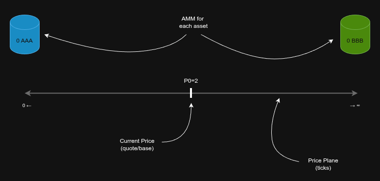
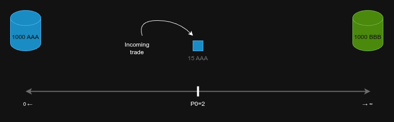
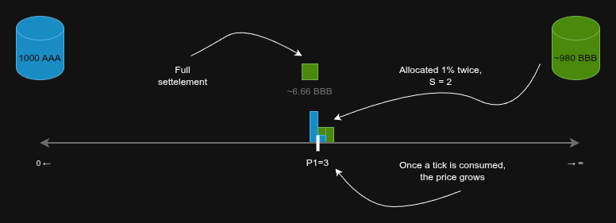
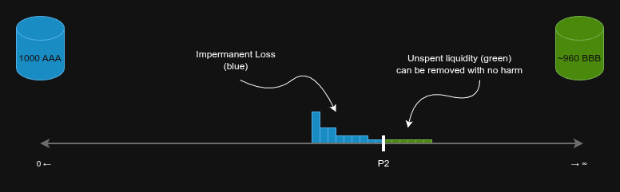

# Drifty By Example | Ep. 2 — Pool Basics

Drifty is a decentralized exchange. It consists of pools - trading pairs, like ETH/USDC. You provide some amount of some token to one of such pools and become a liquidity provider (LP). All your friends can also provide tokens and become liquidity providers of the same pool. Some of you might provide ETH to that pool, while other provide USDC. The token you provide defines your frame of reference - if you want to get more ETH over time, you provide ETH; if you want more USDC, you provide USDC. Other people (traders) use your provided tokens to swap from one token of the pair to another - from ETH to USDC and vice versa.

Inside each pool there are two special workers called _automated market makers_ (AMMs) - one for each token of the pair. You can think of an AMM as of your personal financial manager - you give your tokens to such a manager and it promises to do its best to make profit for you. Those two AMMs in a pool, while having a completely opposite goals - one wants to accumulate more ETH, while the other wants to accumulate USDC - are working in tandem, covering each other's back.

An AMM makes money by selling their **reserve** (tokens provided by the LPs) to traders, exposing itself to some amount of **inventory** (the opposite token of the pair), and then selling this inventory back at more advantageous prices. The difference between buy and sell prices (typically called _the spread_) in Drifty is expressed as **fees** - each trader pays a little premium directly to the AMM for the execution of each of their trades. For example, you provide 10 ETH to the ETH AMM in a ETH/USDC pool, someone buys 1 ETH of that reserve for 4040 USDC (4000 USDC per ETH + 40 USDC fee), then someone else buys back those 4000 USDC for 1.01 ETH - the reserve recovers back to original 10 ETH, plus the AMM earns 40 USDC + 0.01 ETH in fees.

Drifty introduces two main innovations to pools design, which together allows it to be so efficient and completely automatic:

1. Dual-AMM system, which allows Drifty pools to always earn fees, despite the price movement.
2. IL recovery system, which allows automatic impermanent loss recovery and ultra-low slippage.

## Dual-AMM system

Earning fees is the main focus of an AMM: if it is unable to earn fees, it has no spare money to actively recover the inventory. While the AMM has some reserve it can always earn fees - just placing this reserve in a range from current price to current price + avg. monthly volatility.

In many scenarios this setup will make sure we earn fees 24/7. But this is not enough. The markets are not stable like this - the price may hold in some range for quite a significant time, but sometimes the price can make a very large swing, consuming all the available reserve for the token in demand.

Such a price swing is bad for the AMM who now has all the reserve transformed into inventory. Unlike the reserve, the inventory cannot be freely moved - it has to be sold back at the same price it was aquired, otherwise it the AMM ends up at a loss.

Drifty handles this situation via both: a novel and a most natural way possible. First of all, to enable price discovery after the price exits one of the reserves, 5% of all deposited liquidity is always spread in a thin even layer across the whole price plane (from min tick to max tick).

This allows the price to move smoothly while not wasting too much resource. This already provides some fee earning capabilities, but they are obviously not enough.

As we said earlier, in our example, AMM #2 doesn't have any reserve right now - all of it was transformed into inventory, which cannot be moved around freely. But (!) we completely forgot that we have another AMM, which, by coincidence, has zero inventory and a ready-to-move reserve at our disposal. So we use that reserve to earn fees.

The rule is simple: the free of IL AMM should place its reserve in such a way so one of its edges touches the current price and another edge touches the edge of the other AMM's inventory furthest from the current price.

This might sound complicated, but in reality it is very simple. By following this rule we just make sure that our liquidity doesn't have gaps inside (because gaps don't earn fees) and we always touch the price (so when it moves in the opposite direction, we "catch" it with our liquidity).

Three scenarios are possible from here:

1. The price corrects a bit to the left and then oscilates inside our liquidity. The simplest and the best scenario, since it guarantees a lot of fees.

2. The price continues to move to the right, getting further away from its original position. In this scenario we apply the rule of "touching the current price" again and stretch the AMM #1 Reserve even further to the right.

3. The price moves very far to the left in such a way so it consumes both AMM #1 reserve and AMM #2 inventory. The AMM #1 reserve is fully transformed into the inventory and AMM #2 inventory is transformed back to reserve.

In this scenario everything looks bad again - we don't have liquidity to earn fees. But again, as before, while AMM #1 now has everything in the inventory and can't move it, AMM #2 just fully recovered its inventory and has a ready-to-move reserve. So we repeat the rule: one edge of reserve touches the current price, while the other edge touches the furthest from the price edge of the second AMM inventory range. So, we do the same we did before, but in the opposite direction.

(click) <b>What happens if an LP deposits reserve liquidity to AMM #1 in our example?</b>

It will be deposited to a new reserve range, that will follow the rules as the usual. In this specific example, the range will be placed to the left of the current price and it will span avg. monthly volatility long.

 

After this manipulation we arrive again at the same 3 possible future scenarios that we've just reviewed.

This way, Dual-AMM system allows us to ALWAYS have some liquidity touching the current price, ready to earn fees. This property comes not from some magic or super-complex math, but from a simple splitting of AMMs (in most other DEXes the AMM manages both assets in the pair). By splitting the AMMs into two separate entities making sure the liquidity is always in the price range and fees are always earned, = helping each other; we allow for another know-how of Drifty - automatic IL recovery system - to always work efficiently.

## Automatic IL Recovery

The IL recovery system is very simple and works exactly like a professional market maker gets rid of their inventory - by offsetting it with profits earned somewhere else.

Thanks to the dual-amm system, an active pool (where trades happen regularly) always has some surplus of fees. When there is no IL, those fees are efficiently transformed into reserves - essentially growing deposits of all LPs in the pool. But when there is IL, earned fees are used to get rid of it, lowering the slippage.

Each AMM tracks its own inventory (which is a different name for IL). It knows exactly at how much value each tick of IL need in addition, so when sold at the current price it would break even with the amount spent on its aquisition.

The magic starts when a new trade appears, such so it gives the AMM reserve and takes the inventory.

When this happens, if the AMM has some spare fees, instead of simply using the closes reserve tick to handle this trade (like any other DEX works) it would do something else. It will take the furthest IL tick from the current price (worst, most underwater tick), calculate how much does it need additional inventory to be added in order to be sold at the current price with NO loss in value (to break even).

Then it will take that last tick + needed fees and use it to settle the incoming trade, effectively doubling the liquidity at the current tick.

This is a very strong place of the protocol. By moving the worst IL tick on top of the best IL tick, we deepening the liquidity, lowering the slippage significantly. Lower slippage means more trades in that direction. More trades mean more fees and faster IL recovery.

When the IL tick is sold, it is added back to the reserve. If we have a lot of earned fees, we can sell multiple worst ticks without even touching the best tick (moving the price). If we have little fees, we sell only a piece of the worst IL tick, instead of the whole.

<b>When the IL is recovered, the inventory range of that AMM becomes smaller. Does this mean that the another's AMM reserve range, following the rule of touching this inventory, should also pull a little, concentrating?</b>

Yes, absolutely! When one AMM recovers its IL, another AMM can concentrate his reserves little by little, allowing for even deeper market and lower slippage (and more fees!). This is the magic of Drifty - just as a consequence of our simple rules, the liquidity is automatically getting concentrated when it can, or relaxed when it needs to be relaxed. 

 

## Outro

Those two simple systems: dual-amm and automatic IL recovery, while quite unusual for a DEX, enable Drifty with unmatched performance and 100% hands-free experience.

// TODO: a more sophisticated and braggy outro

#### Read Next

(coming soon) [Ep. 3 — Infinite Scalability]()

**If you have more questions, don't hesitate to ask in the [Telegram group](https://t.me/driftyicp).**
