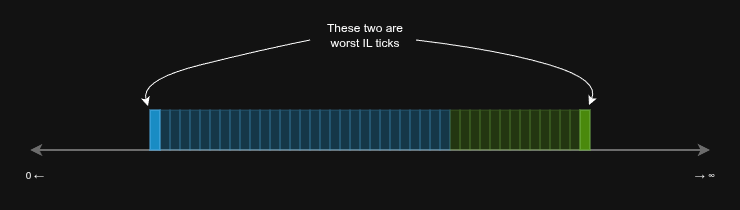

# Drifty By Example | Ep. 3 — Impermanent Loss Recovery

In the last episode, we saw our pool get its first taste of action. After a few trades, the BBB token AMM was left with some impermanent loss (IL).

So, how does Drifty deal with this? To get it, let's take a quick detour and look at how regular market makers operate on a centralized exchange (CEX) like Binance.

They have a **reserve** of an asset they want to end up with more of. Some of this is on the order book (allocated), and the rest is in their back pocket (unallocated). They also have an **inventory** of the other asset in the pair, which they've bought. A market maker's job is to buy some inventory, then sell it at a higher price to make a profit, increasing their reserve. The price difference between their buy and sell orders is called the **spread**.

See the resemblance? Drifty works in a very similar way. It combines all the LPs in a pool into two AMMs that want opposite things but work together.

| CEX Market Maker | Drifty AMM           | What it is                                             |
| :--------------- | :------------------- | :----------------------------------------------------- |
| **Pocket**       | **Reserve**          | "Money" waiting to be used to make more "money".       |
| **Orders**       | **Allocated Ticks**  | "Money" that's been put to work on the market.         |
| **Inventory**    | **Impermanent Loss** | An asset you need to sell off, hopefully for a profit. |
| **Spread**       | **Dynamic Fees**     | The price gap that makes you profitable.               |

Market makers on CEXs make money consistently not because they're lucky, but because they follow a strategy that minimizes their risk.

This is the main idea behind Drifty. **Drifty is just an implementation of a market-making strategy on a massive scale.** This strategy runs automatically for all LPs, so the only real risk they face is having to wait for their positions for too long to turn a profit.

> This is a big deal compared to other DEXs. There, the main "strategy" is often to bet both for and against a token at the same time (a delta-neutral strategy).
>
> Otherwise, you're expected to be a full-time analyst: watching prices, manually calculating your IL with messy formulas, managing 10+ positions, and being ready to react 24/7 to any sudden price move. And if you're not on a super-fast, cheap blockchain like the ICP, you're also bleeding money on gas fees.
>
> It's just not practical for most people.

## Let's Get Real

The IL we saw in Episode 2 is realistic, but the scale is tiny. A lot of DEXs use these small-scale examples in their marketing to make everything look perfect. Their rebalancers always work, their volumes are always high enough to cover losses, and volatility is never more than a fraction of a percent.

But crypto isn't like that. It's all about high volatility and unexpected events. We see huge whale trades, market manipulation, and rug pulls all the time. Looking at those "perfect" simulations makes you want to ask: "**Okay, that's cute. Now show me what happens when the price swings 50% and everyone loses interest in the asset.**"

So, let's do just that.

1.  Let's imagine a "black swan" event — a sudden, massive price shock.
2.  We'll zoom out and look at the big picture to see how the system holds up.

Say things were going well in our AAA/BBB pool for a while. The price was stable, and liquidity automatically clustered around it (see how below).

Both AMMs have either spent their reserves to get inventory or have them fully allocated. This looks risky, right? If the price moves too far one way or the other, it will fall out of the allocated range, and the pool will have no liquidity.

For a simple DEX (like Uniswap V1), this isn't a problem — they just keep operating, but poorly, at any price. For a concentrated liquidity DEX, it's a disaster. The price gets stuck because "nobody is selling."

But because of Drifty's dual-AMM design, this isn't the case. What's a loss for one AMM is a gain for the other. No matter which way the price moves, it always eats up one AMM's reserve (turning it into IL) but at the same time, it frees up the other AMM's IL, turning it back into a usable reserve.

> In reality, the AAA AMM doesn't just de-allocates and then re-allocates all its reserves back at once. It periodically checks on its allocated liquidity and adjusts it. One edge of its liquidity is always lined up with the start of the other AMM's IL (worst IL tick, see below), while the other edge follows the current price. This is done lazily, without wasting a lot of the pool's resources, and keeps the reserves in a good position to earn fees.

Now, the price has shot up, and the BBB AMM is sitting on a lot of IL.

Drifty doesn't care how much further the price goes. Yes, the BBB AMM doesn't have much liquidity left to generate fees, but it always keeps a little bit back (at least 1% of its total liquidity) to help with price discovery. And the AAA AMM? It has **all** of its original liquidity back and ready to go.

So, let's say the price goes up 1000%. The BBB AMM uses its remaining 1% to allow for this price discovery, following the logarithmic rule from Episode 2. And every 10 minutes, the AAA AMM has been adding on-timer liquidity allocations. Here's how it would look:

Everything is fine. If the price goes further up, the BBB AMM will just allocate more on-demand liquidity, and the AAA AMM will stretch its reserves to follow. If the price goes back down into the allocated range, great — the pool earns fees. If the price crashes all the way back to P0 and below, that's also fine. It just mirrors the situation, naturally recovering the BBB AMM's inventory.

So, it doesn't matter. The price can do whatever it wants. Drifty can always find liquidity to put under the current price and earn fees.

> Sure, if the price does something insane like a million-percent surge, the liquidity layer can get very thin, which means more slippage and slower trading. But the core guarantee Drifty gives — "you will eventually get your original deposit back if the pool is active" — still holds. It will just take longer.

## Getting Rid of the Inventory

Okay, so we know Drifty can always find liquidity. But how does it get rid of the inventory and recover the IL? How does it concentrate liquidity back where it's useful?

This is where it gets really interesting. The key is one component we've mentioned a few times but haven't explained: **dynamic fees**.

Just like any other DEX, Drifty charges a small fee when you swap tokens. These fees are split among the LPs. But what's different in Drifty is that the fee percentage changes depending on how much IL the pool has. In other words, the crazier the price action, the more fees are collected.

This solution is simple, but it fixes everything:

-   **It profits from volatility.** Days with big price swings are when people trade the most. Some are chasing a pump (FOMO), others are taking profits. They all want to trade **right now**. Drifty sees this happening and raises the fees to benefit the LPs.

-   **It works for any pair.** This makes Drifty pools great for both volatile and stable pairs. In volatile pairs, fees react to the market. In stable pairs, fees will usually be tiny (down to 0.0001%) because the price doesn't move much. But if a stablecoin de-pegs, the LPs can actually profit from the chaos instead of losing everything. It's all automatic.

-   **It only looks at itself.** The fee is based only on what's happening inside the pool. No oracles, no external indicator feeds. All that matters is how the LPs **of this particular pool** are doing. If they have little IL, the fee is low. If they just took a big hit, the fees go up to help them recover. This also makes the fee size harder to manipulate from the outside.

Let's go back to our example. After that huge price surge, a correction starts.

In Drifty, the fees aren't just handed out to LPs. Instead, they're used to buy back the "worst" IL ticks — the ones furthest away from the current price.

Let's say the worst AAA IL tick has 100 AAA in it, and its price is 1. That means back when the price was 1, we spent 100 BBB to create that tick. Now, the price is 2. That 100 BBB we spent is now worth 200 AAA. So, to recover that tick, we need to earn additional 100 AAA in fees.

If the pool just earned 10 AAA from a trade, we can use it to take 10 AAA from that worst tick and put it back into the reserve. **It's that simple.** We can keep doing this until the whole tick is gone.

See where this is going? By earning fees, the AMMs can constantly "pinch" a little bit from their IL, turning it back into reserves that can be immediately reused near the current price to earn even more fees. And remember, the reserves are always adjusted to line up with the edge of the other AMM's IL. So, once we recover the worst IL tick, the one next to it becomes the new worst tick, and the reserve ticks can be "thickened."

Over time, no matter how thinly the liquidity was scattered, it will start to concentrate around the current price. It gets thicker and deeper right where the action is.

This process keeps going, and it gets faster as the worst IL ticks get closer to the current price because you need fewer fees to recover them. Eventually, all the IL can be resolved. In extreme cases, like a stablecoin pair, all the liquidity will just be transformed into two tall, skinny towers right next to the price.

This means that LP positions are effectively compounding. The profit they earn is automatically put back into their position to make it bigger. LPs are then free to cut a piece of their position whenever they want and use that profit however they see fit, while letting the rest of the position continue to work.

So, impermanent loss isn't some permanent problem. In Drifty, it's just a temporary state. The system is designed to automatically work its way out of it, using the market's own energy to heal itself.

#### Read Next

(coming soon) [Ep. 4 — The LP Gateway]()

---

Ask questions and leave feedback via our [Telegram group](https://t.me/driftyicp).
